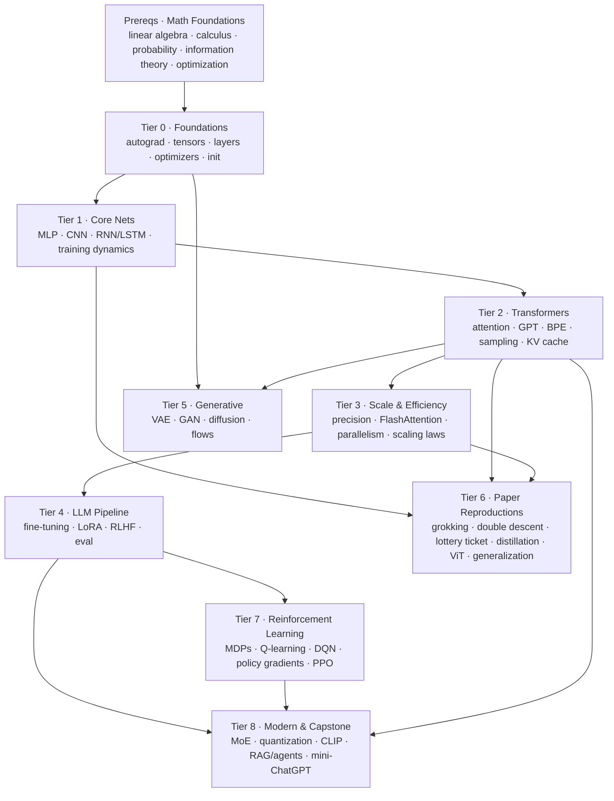

# All About Neural Networks — Deep Learning From Scratch

> A 47-notebook curriculum that rebuilds modern deep learning from first principles — applied math → autograd → GPT → diffusion → reinforcement learning → six reproduced landmark papers → a working mini-ChatGPT — every piece coded from scratch and verified against PyTorch.

[](https://github.com/shiva-shivanibokka/All-about-Neural-Networks/actions/workflows/ci.yml)


---

## 🎯 Recruiter TL;DR

- **What it is:** a from-scratch deep-learning curriculum — 47 executable Jupyter notebooks across a math-prerequisites tier + 9 tiers — that rebuilds every core component of modern ML (reverse-mode autograd, CNNs, RNN/LSTMs, transformers/GPT, LLM fine-tuning & RLHF, VAEs/GANs/diffusion, reinforcement learning, MoE, quantization, CLIP, RAG/agents) in pure NumPy or bare PyTorch, then **verifies each implementation against PyTorch's reference** — culminating in an end-to-end **mini-ChatGPT** (pretrain → SFT → DPO → serve).
- **Hardest problem solved:** implementing the full transformer/LLM stack from scratch — reverse-mode autograd, scaled-dot-product & multi-head attention, a trainable GPT, BPE tokenization, KV-cache inference, FlashAttention's tiled/online-softmax algorithm, LoRA, and the RLHF/RL stack (MDPs → Q-learning → policy gradients → PPO → reward model + DPO) — with hand-written backward passes matching PyTorch to machine precision (~1e-14).
- **Grounding:** every notebook runs end-to-end and carries inline `assert`-based correctness checks — **112 asserts across all 48 notebooks**, so a regression fails the notebook rather than quietly printing a wrong number. The from-scratch GPT trains on tiny-Shakespeare to **1.56 nats/char** (vs. 4.17 random baseline); of six reproduced papers five match the original findings and the sixth is reported as the partial reproduction it actually is; and the RL stack learns a from-scratch CartPole and a gridworld from nothing but self-built environments.

---

## Overview & Motivation

Most people can *use* PyTorch. Far fewer can *rebuild* it — and rebuilding is the fastest way to actually understand it. This repository is my systematic, ground-up reconstruction of modern deep learning, built as preparation for research residencies (OpenAI / Apple and similar), where the bar is **implementing ideas from scratch and reproducing papers**, not calling library functions.

The guiding rule for every notebook: **build the novel mechanism from scratch (NumPy or bare PyTorch — no `nn.Transformer`, no `nn.MultiheadAttention`, no black boxes for the core idea), then verify it against PyTorch's reference implementation.** Autograd is built from a scalar `Value` class up to a full tensor engine; attention is written matmul-by-matmul; optimizers are re-derived and checked step-for-step against `torch.optim`. Where a training loop needs GPU speed, PyTorch's autograd does the *plumbing* — but the idea under study is always hand-built and cross-checked.

Each notebook follows the same teaching arc: **intuition & analogy → step-by-step math derivation → from-scratch code → experiment → "what to notice" → exercises → interview-style Q&A → cited references.** They are visualization-rich (computational graphs, attention heatmaps, loss surfaces, latent manifolds, denoising trajectories) and end with the specific papers each one implements.

---

## Skills Demonstrated

- **ML/DL fundamentals from first principles** — reverse-mode automatic differentiation, backpropagation, the multivariate chain rule, and hand-derived gradients for every common layer (Linear, Conv2d, BatchNorm, LayerNorm, GELU, softmax-cross-entropy).
- **Transformer & LLM internals** — scaled dot-product / multi-head / causal attention, positional encodings (sinusoidal & RoPE), GPT training, BPE tokenization, sampling/decoding strategies, KV-cache inference, FlashAttention.
- **LLM training pipeline** — pretraining → fine-tuning, LoRA / parameter-efficient fine-tuning, RLHF (Bradley-Terry reward modeling, PPO, DPO), instruction tuning, and LLM evaluation methodology.
- **Generative modeling** — VAEs (reparameterization, ELBO), GANs (adversarial training, mode collapse), diffusion/DDPM, normalizing flows — the four major generative families.
- **Scaling & systems** — mixed-precision numerics, data/tensor/pipeline/FSDP parallelism, scaling laws, KV-cache inference, Mixture-of-Experts, quantization (int8/int4/GPTQ).
- **Reinforcement learning** — MDPs & dynamic programming, Q-learning/SARSA, DQN, policy gradients & actor-critic, PPO — the foundations under RLHF.
- **Modern & multimodal** — CLIP/contrastive learning, retrieval-augmented generation (RAG), tool-using agents (ReAct), and an end-to-end LLM assistant pipeline.
- **Applied mathematics** — linear algebra (SVD, eigen), vector calculus (Jacobians, chain rule), probability & MLE, information theory (entropy, KL), and optimization — derived and tied to their use.
- **Numerical methods & verification** — gradient checking, numerical stability, and reference-implementation cross-validation.
- **Research paper reproduction** — a repeatable read → minimal-repro → run → ablate → report workflow, applied to six landmark papers.
- **Scientific communication** — derivations, honest result reporting (calibrated to measured numbers, no overclaiming), and interview-ready explanations.

---

## What's Inside — The Curriculum

A **Math Foundations** prerequisites tier plus **nine tiers**, each building on the last. Every notebook is self-contained, executable, and cites the papers it implements.

### Prerequisites · Math Foundations — *the applied math the rest of the repo uses*
| # | Notebook | Covers (tied to where it's used) |
|---|----------|----------------------------------|
| M1 | Linear algebra for DL | vectors, matmul, transpose, eigen, **SVD**, determinant/Jacobian |
| M2 | Calculus & vector calculus | derivatives, gradient, **Jacobian**, multivariate chain rule (= backprop), Hessian |
| M3 | Probability & statistics | distributions, expectation, **MLE** (→ cross-entropy/MSE), Bayes, Monte Carlo |
| M4 | Information theory | entropy, **cross-entropy, KL divergence**, perplexity |
| M5 | Optimization & numerics | gradient descent, convexity, condition number, Newton, log-sum-exp |

### Tier 0 · Foundations — *the machinery under everything*
| # | Notebook | Builds from scratch |
|---|----------|---------------------|
| 01 | Autograd from scratch | Scalar reverse-mode autodiff (a `Value` class), topological sort, the chain rule; trains an MLP on its own engine |
| 02 | Tensors & tensor autograd | NumPy tensor autograd: broadcasting (`unbroadcast`), matmul chain rule, softmax cross-entropy; a 2-moons classifier |
| 03 | Backprop through classic layers | Hand-derived backward passes for Linear, ReLU/GELU, LayerNorm, BatchNorm, Conv2d (im2col) — all gradient-checked |
| 04 | Optimizers from scratch | SGD → Momentum → Nesterov → RMSProp → Adam → AdamW, visualized on loss surfaces, matched to `torch.optim` |
| 05 | Weight init & normalization | Xavier/Kaiming derived from variance preservation; residual connections as gradient highways |

### Tier 1 · Core Neural Nets
| # | Notebook | Focus |
|---|----------|-------|
| 06 | MLP end-to-end (MNIST) | Full training pipeline; overfitting shown via the validation-loss U-curve; dropout + weight decay |
| 07 | CNN from scratch | im2col conv/pool verified vs PyTorch; LeNet beats an MLP with fewer parameters; learned-filter visualization |
| 08 | RNN & LSTM from scratch | Backprop-through-time by hand; the vanishing-gradient problem measured; a char-level language model |
| 09 | Regularization & training dynamics | LR schedules (warmup + cosine), label smoothing, gradient clipping, early stopping — each shown on a real curve |

### Tier 2 · Transformers
| # | Notebook | Focus |
|---|----------|-------|
| 10 | Attention from scratch | Scaled dot-product → multi-head; causal masking; sinusoidal & RoPE positions; attention heatmaps |
| 11 | **GPT from scratch** | A full decoder-only transformer trained on tiny-Shakespeare; hand-written attention matched to PyTorch's kernel |
| 12 | Tokenization / BPE | Byte-pair encoding from scratch; compared to `tiktoken`; why tokenization causes LLM failure modes |
| 13 | Sampling & decoding | Greedy, temperature, top-k, top-p, beam search, speculative decoding |
| 14 | KV cache & inference | The O(n²)→O(n) generation speedup, the memory cost, and prefill-vs-decode systems tradeoffs |

### Tier 3 · Scale & Efficiency
| # | Notebook | Focus |
|---|----------|-------|
| 15 | Mixed precision & numerics | fp32/fp16/bf16, gradient underflow, loss scaling, fp32 master weights — why bf16 won |
| 16 | FlashAttention from scratch | Online (streaming) softmax + tiling → exact attention in O(n) memory, verified identical to standard attention |
| 17 | Parallelism | Data / tensor / pipeline / FSDP — each simulated and shown to reassemble exactly; the pipeline bubble |
| 18 | Scaling laws | A trained power-law sweep fitting the Kaplan form `L = L∞ + A·N^-α` (L∞ ≈ 1.47, α ≈ 0.27); the compute-optimal argument |

### Tier 4 · LLM Pipeline
| # | Notebook | Focus |
|---|----------|-------|
| 19 | Pretraining → fine-tuning | The transfer-learning payoff, quantified; full fine-tune vs linear probe |
| 20 | LoRA / PEFT | Low-rank adapters from scratch; the low-rank premise verified via SVD; merge equivalence; rank sweep |
| 21 | RLHF: reward model + PPO + DPO | Bradley-Terry reward modeling, PPO, and DPO — the full alignment stack on a controlled toy |
| 22 | Instruction tuning & evaluation | Base vs instruction-tuned models; an eval harness; why LLM evaluation is the genuinely hard part |

### Tier 5 · Generative Models
| # | Notebook | Focus |
|---|----------|-------|
| 23 | VAE from scratch | Reparameterization trick, ELBO, a 2-D latent manifold visualization |
| 24 | GAN from scratch | The adversarial game; mode collapse on an 8-Gaussian ring; sharper MNIST samples |
| 25 | Diffusion (DDPM) | Forward/reverse processes, the noise-prediction objective; denoising trajectory + MNIST generation |
| 26 | Normalizing flows | RealNVP coupling layers; exact likelihood via change-of-variables |

### Tier 6 · Paper Reproductions — *the residency skill*
A repeatable reproduction workflow applied to six landmark results:

| # | Notebook | Paper reproduced | Result |
|---|----------|------------------|--------|
| 27 | Reproduction workflow + **Grokking** | Power et al. 2022 | Sudden generalization ~29× *after* memorization; weight-decay ablation confirms the mechanism |
| 28 | **Deep Double Descent** | Nakkiran et al. 2019 | Test-error peak exactly at the interpolation threshold, second descent beyond it |
| 29 | **Lottery Ticket Hypothesis** | Frankle & Carbin 2018 | Ticket holds dense accuracy at ~3% of weights; the control degrades but mostly by *variance* — a partial reproduction, reported as such |
| 30 | **Knowledge Distillation** | Hinton et al. 2015 | Student distilled from unlabeled data reaches ~teacher accuracy, far above its own labels |
| 31 | **Vision Transformer (ViT)** | Dosovitskiy et al. 2020 | Pure-transformer image classifier; the data-efficiency caveat vs CNNs |
| 32 | **Rethinking Generalization** | Zhang et al. 2016 | Networks fit random labels to 100% train accuracy — capacity ≠ generalization |

### Tier 7 · Reinforcement Learning — *the foundations under RLHF*
| # | Notebook | Focus |
|---|----------|-------|
| 33 | MDPs & dynamic programming | value/policy iteration on a from-scratch gridworld; the Bellman equation |
| 34 | Model-free RL | Monte Carlo, TD, SARSA vs Q-learning (cliff-walking safe-vs-optimal path) |
| 35 | Deep Q-Networks (DQN) | neural Q + experience replay + target network on a from-scratch CartPole; learns a real policy (7× the random baseline) without reaching the "solved" bar — the deadly triad, measured |
| 36 | Policy gradients & actor-critic | REINFORCE, measured variance reduction, advantage/actor-critic |
| 37 | PPO derived | trust region → clipped surrogate objective; connected directly to RLHF (NB21) |

### Tier 8 · Modern Architectures & Capstone
| # | Notebook | Focus |
|---|----------|-------|
| 38 | Mixture of Experts (MoE) | sparse top-k routing + the load-balancing loss; expert specialization |
| 39 | Quantization | int8/int4 post-training quantization; the accuracy-vs-size tradeoff; GPTQ idea |
| 40 | CLIP / multimodal | contrastive (InfoNCE) image-text alignment; zero-shot classification |
| 41 | RAG & agents | retrieval-augmented generation + a ReAct tool-using agent loop |
| 42 | **Capstone: mini-ChatGPT** | end-to-end **pretrain → SFT → DPO → serve** — a working tiny assistant |

---

## Verification Standard

The defining feature of this repo: **claims are checked, not asserted.** Representative verified results (all produced by executing the notebooks):

- **Autograd** matches PyTorch gradients to ~1e-9; **hand-derived layer backward passes** (LayerNorm, BatchNorm, Conv2d) match to ~1e-14.
- **All six optimizers** match `torch.optim` to < 1e-6 across their full 40-step trajectories.
- **FlashAttention** produces output *identical* to standard attention (≈4e-16) while never materializing the n×n score matrix.
- **From-scratch GPT** trains on tiny-Shakespeare to **1.56 nats/char** (random baseline: 4.17) and generates coherent Shakespearean text.
- **Reproductions** land: grokking's delayed generalization (val "groks" ~29× after memorization, with a weight-decay ablation at 1.000 vs 0.001), double descent's test-error peak exactly at the interpolation threshold, distillation's transfer to a small student (0.972 vs 0.882, averaged over 3 seeds), and 100%-train-accuracy memorization of random labels.
- **One reproduction only partially holds, and says so.** The lottery ticket keeps dense accuracy at 2.8% of weights (0.895 ± 0.043 vs 0.925 dense), but over 5 seeds the random-reinit control is beaten by only **+0.053** on average — and the effect shows up as *variance*, not separation: the control's seed-to-seed spread explodes to ±0.077 while the ticket's stays at ±0.005. An earlier single-seed run drew a collapsed control and reported a 0.195 gap; that number did not reproduce. NB29 now reports the weaker result and explains which knobs (full 60k train set, longer training, early-stopping selection) the original paper had that this budget doesn't.
- **RL** works from scratch: value and policy iteration agree on the gridworld optimum, DQN learns a from-scratch CartPole (best episode 407 of 500 steps, peak 50-episode average 168 against a 25-step random baseline — a real policy, but well short of the conventional 475 "solved" bar, which is the deadly-triad instability NB35 then dissects), and PPO's clipped objective climbs to a 408 peak — all on self-built environments (no gym).
- **The capstone** runs the full LLM lifecycle end-to-end: a small GPT goes from 0% instruction-following (pretrain only) to ~100% after SFT, then DPO-aligned and served — producing a working (tiny) assistant.

Every notebook carries `assert`-based correctness checks — 112 of them — and is run top-to-bottom before shipping, so figures and outputs are real, not placeholders. Where a notebook's point is an experimental result rather than a reference comparison, the assert encodes the claim itself (grokking's delay is >10× its memorization step; the double-descent peak sits at the interpolation threshold; instruction tuning moves held-out tasks from ~0 to >0.9).

---

## Architecture

The curriculum is a **dependency graph**: a small from-scratch engine (autograd → layers → optimizers → init) is built once in Tier 0, then reused and extended upward. Later tiers build the transformer stack on that foundation, then scaling/LLM/generative topics, culminating in paper reproductions that synthesize everything.



**Why this shape:** the hardest ideas (attention, RLHF, diffusion) are only tractable to build once the primitives (autograd, backprop, optimization) — themselves resting on the applied math in the Prerequisites tier — are truly owned. So the foundations are deliberately exhaustive and everything above reuses that engine rather than re-deriving it. Reproductions and the capstone come last because they require fluency across the whole stack (the mini-ChatGPT in Tier 8 literally assembles pieces from Tiers 0, 2, 4, and 7).

---

## Tech Stack

| Tool | Version | Role |
|------|---------|------|
| Python | 3.12 | Language |
| PyTorch | 2.6 (CUDA) | Reference implementation to verify against; GPU-accelerated training in later tiers |
| NumPy | 1.26 | The from-scratch engine (Tier 0–1 autograd, layers, FlashAttention) is pure NumPy |
| Matplotlib | 3.10 | All visualizations (computational graphs, attention maps, loss surfaces, latent manifolds) |
| torchvision | 0.21 | MNIST loading only |
| tiktoken | 0.12 | Comparison baseline for the from-scratch BPE tokenizer |
| Jupyter / nbconvert | — | Notebook authoring and end-to-end execution |

A CUDA GPU is used for the training-heavy notebooks (Tiers 1–8); everything degrades gracefully to CPU (built and tested on an RTX 4060 Laptop GPU). The Prerequisites (math) and pure-algorithm notebooks (BPE, FlashAttention, RAG) run on CPU alone.

---

## Getting Started

```bash
# 1. Clone
git clone <your-repo-url> && cd All-about-Neural-Networks

# 2. Create an environment (Python 3.10+)
python -m venv .venv && source .venv/bin/activate      # Windows: .venv\Scripts\activate

# 3. Install dependencies
pip install -r requirements.txt
#    For GPU acceleration, install the CUDA build of PyTorch for your system
#    from https://pytorch.org/get-started/locally/

# 4. Launch Jupyter and start at Tier 0
jupyter lab      # or: jupyter notebook
```

Then open `Tier 0 - Foundations/01_autograd_from_scratch.ipynb` and work upward — the tiers are ordered so each builds on the last. Datasets (MNIST, tiny-Shakespeare) download once to a single `data/` folder at the repo root on first run (git-ignored) and are reused from there. If a download fails the notebook stops with an explicit error rather than silently substituting placeholder text.

---

## Usage

Each notebook is meant to be **read and run top-to-bottom** — the narrative, math, and code are interleaved. Notebooks are also self-verifying; for example, the autograd engine checks itself against PyTorch:

```python
# From Tier 0 · 01_autograd_from_scratch.ipynb
a = Value(0.7); b = Value(-1.3); c = Value(2.1)
L = (a*b + a.exp()).tanh() + (c * a**2).relu() + a / (b + 2.0)
L.backward()                                  # our from-scratch reverse-mode autodiff

# ...compared against PyTorch on the same graph:
assert all(abs(o - t) < 1e-9 for o, t in zip(ours, theirs))
print("✅ matches PyTorch to ~1e-9")
```

To run a notebook non-interactively (e.g. to reproduce all outputs):

```bash
jupyter nbconvert --to notebook --execute --inplace "Tier 2 - Transformers/11_gpt_from_scratch.ipynb"
```

---

## Project Structure

```
All-about-Neural-Networks/
├── Prerequisites - Math Foundations/     # linear algebra, calculus, probability, info theory, optimization (5 notebooks)
├── Tier 0 - Foundations/                 # autograd, tensors, layers, optimizers, init (5)
├── Tier 1 - Core Neural Nets/            # MLP, CNN, RNN/LSTM, training dynamics (4)
├── Tier 2 - Transformers/                # attention, GPT, BPE, sampling, KV cache (5)
├── Tier 3 - Scale and Efficiency/        # precision, FlashAttention, parallelism, scaling laws (4)
├── Tier 4 - LLM Pipeline/                # fine-tuning, LoRA, RLHF, eval (4)
├── Tier 5 - Generative Models/           # VAE, GAN, diffusion, flows (4)
├── Tier 6 - Paper Reproductions/         # grokking, double descent, lottery ticket, KD, ViT, generalization (6)
├── Tier 7 - Reinforcement Learning/      # MDPs, Q-learning, DQN, policy gradients, PPO (5)
├── Tier 8 - Modern Architectures and Capstone/  # MoE, quantization, CLIP, RAG/agents, mini-ChatGPT (5)
├── micrograd_NN_from_scratch.ipynb       # early standalone micrograd exploration
├── tools/check_claims.py                 # verifies README + notebook prose against committed outputs
├── .github/workflows/ci.yml              # executes the 28 dataset-free notebooks + the claims check
├── requirements.txt
├── LICENSE
└── README.md
```

Each notebook is standalone and ends with a **📚 References & papers** section citing the work it implements.

---

## Testing

There is no separate unit-test suite — instead, **each notebook is its own executable test.** Every notebook:

- carries inline `assert`-based correctness checks (gradient checks against finite differences, output comparisons against `torch.optim` / `F.scaled_dot_product_attention` / `F.conv2d` / etc.), so a broken implementation fails loudly on execution;
- is run end-to-end with `jupyter nbconvert --execute` before being committed, so all embedded figures and printed outputs reflect real runs.

Reproducing the full repo is therefore: execute every notebook and confirm no cell errors and no failed asserts. `jupyter nbconvert --to notebook --execute` exits non-zero on either, so this is a single scriptable check.

### What CI actually runs

[`.github/workflows/ci.yml`](.github/workflows/ci.yml) executes on every push:

- **28 of the 48 notebooks** — every one that needs neither a network fetch nor a dataset download. That covers the from-scratch engine end to end: autograd, the hand-derived layer backward passes, all six optimizers, attention, FlashAttention, the parallelism simulations, and the full RL stack. They run CPU-only in ~8 minutes of compute, split across a 6-way matrix.
- The remaining 20 pull MNIST or tiny-Shakespeare and mostly want a GPU, so they stay a manual pre-commit pass. A CI job that re-downloads MNIST to test a runner's internet connection guards nothing, so it isn't there.
- **[`tools/check_claims.py`](tools/check_claims.py)** — a second, one-second job that executes nothing. It reads the committed outputs and verifies that every number quoted in this README and in notebook prose is still backed by one.

That last one exists because of a specific failure. Numbers here live in three places: inside `assert`s (self-enforcing), inside printed output (regenerated every run), and inside markdown prose — which **cannot** self-update. Retuning a random-policy baseline in NB35 shifted its RNG stream, the DQN result moved from 500/209 to 407/168, and three sentences quoting the old figures silently became wrong. The asserts didn't catch it because the asserts were still true. `check_claims.py` pins the load-bearing numbers to the outputs they came from, so that class of rot fails the build instead.

---

## Results / Impact

This is an educational/portfolio repository, so "impact" is measured in *correctness and completeness of the reconstructions*, all produced by executing the notebooks:

- **47 numbered notebooks** (plus an early standalone micrograd exploration — 48 in total), from applied math and a scalar autograd engine to a trained GPT, six reproduced papers, a reinforcement-learning stack, and a working mini-ChatGPT — each verified against a PyTorch reference, exact/analytic ground truth, or an asserted experimental claim.
- **From-scratch GPT**: 1.56 nats/char on tiny-Shakespeare (random baseline 4.17), generating coherent text.
- **Machine-precision agreement** with PyTorch on all hand-written gradients and optimizers (~1e-14 to 1e-9).
- **Six landmark papers reproduced**: five match the original findings; the lottery-ticket result only partially replicates at this compute budget and is reported that way, with the seed-variance evidence and the knobs that would close the gap.
- **Full LLM lifecycle** assembled end-to-end (pretrain → SFT → DPO → serve) and an **RL stack** (MDPs → Q-learning → DQN → PPO) built from scratch on self-made environments.

No production deployment, external users, or business metrics are claimed — this is a learning and research-preparation artifact.

---

## Roadmap / Future Work

- **Classical ML from scratch** — a foundations tier covering linear/logistic regression, PCA, k-means, k-NN, decision trees, bias-variance, and cross-validation, to ground the deep-learning material.
- Scale the from-scratch GPT with BPE tokens (Tier 2's tokenizer) and a longer context, and reproduce a slice of the GPT-2 loss curve end-to-end.
- Additional reproductions and modern architectures (state-space models / Mamba, a DDIM sampler).
- Convert the shared from-scratch engine into an importable `mininn` package so later notebooks import it rather than restating it.
- Extend CI to the dataset-dependent notebooks by caching MNIST and tiny-Shakespeare between runs, so all 48 execute on push rather than 28.

---

## License

Released under the **MIT License** — see [`LICENSE`](LICENSE).

---

*Built as ground-up preparation for ML research residencies. If you're learning deep learning, start at Tier 0 and build upward — the fastest way to understand a system is to rebuild it.*
